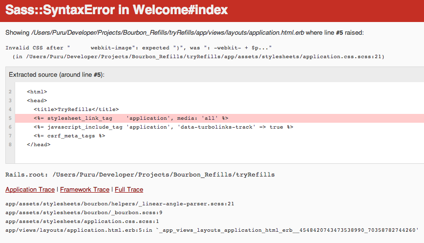

### Steps I followed:-

```
~> rails new tryRefills

```

####Gemfile
*Updated with*

```
gem 'bourbon'
gem 'refills'
gem 'bitters'
gem 'neat'

```

####Bundle install

```
~> bundle install

```

####application.css.scss
*Updated with*

```
@import "bourbon/bourbon";
@import "bitters/bitters";
@import "neat/neat";
@import "refills/cards";
@import "refills/footer";
@import "refills/hero";
@import "refills/navigation";

```

####Terminal
*Within app/assets/stylesheets*

```
~> bourbon install
~> bitters install
~> neat install
~> rails g refills:import navigation
~> rails g refills:import hero
~> rails g refills:import cards
~> rails g refills:import footer

```

####Error:-

